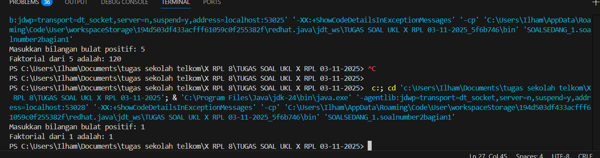

💻 Program Menghitung Faktorial Bilangan
📘 Deskripsi

Program ini digunakan untuk menghitung faktorial dari suatu bilangan bulat positif yang dimasukkan oleh pengguna.
Program ditulis menggunakan bahasa Java, dan menggunakan konsep fungsi (method) bernama faktorial() untuk memisahkan logika perhitungan dari fungsi utama (main).

⚙️ Cara Kerja Program

Pengguna diminta untuk memasukkan sebuah bilangan bulat positif.

Program memeriksa apakah bilangan yang dimasukkan bernilai negatif.

Jika negatif, maka akan muncul pesan "Bilangan harus positif!".

Jika positif, maka program akan menghitung faktorial menggunakan perulangan for.

Hasil faktorial ditampilkan di layar.

🧩 Kode Program
package SOALSEDANG_1;

import java.util.Scanner;

public class soalnumber2bagian1 {
    static void faktorial() {
        Scanner input = new Scanner(System.in);

        System.out.print("Masukkan bilangan bulat positif: ");
        int n = input.nextInt();

        if (n < 0) {
            System.out.println("Bilangan harus positif!");
            return;
        }

        long hasil = 1;
        for (int i = 1; i <= n; i++) {
            hasil *= i;
        }

        System.out.println("Faktorial dari " + n + " adalah: " + hasil);

        input.close();
    }

    public static void main(String[] args) {
        faktorial();
    }
}

🧮 Contoh Hasil Program

Contoh 1 (input positif):

Masukkan bilangan bulat positif: 5
Faktorial dari 5 adalah: 120

Contoh 2 (input negatif):

Masukkan bilangan bulat positif: -3
Bilangan harus positif!

## 💻 Screenshot Output
